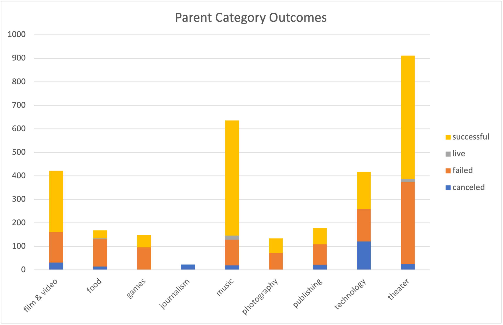
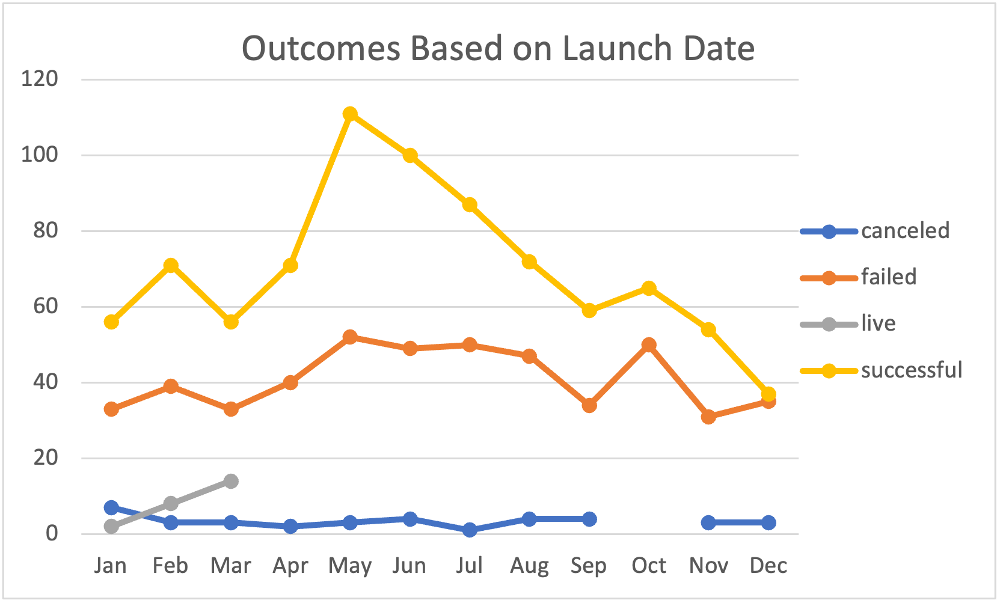
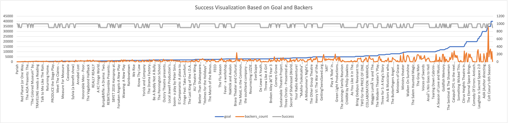

# An Analysis of Kickstarter Campaigns

This analysis was done on crowded funded campaigns for different businesses across the world. The goal is to analyze how successful would it be to start a campaign for play requiring around $10,000 as the goal.

On the initial look at campaign data based on intiative, theatre looks to have a 60% success rate. Comparing with other categories next to music (77%), film/video and plays look to be the next best area to have successful campaigns. The below image as the outcome distribution for each parent category

Looking at a good time to run a campaign, launching it on May looked to be a good option with increased success rate. This pattern remainined the same for different countries and initiatives. The below image shows the mentioned pattern.

The median goal that has been successful was around $5000. With the $10,000 set as goal, this showed a slightly increased risk. The upper quartile of goal also sitting at $5000 indicated the same.

To check the success parameters of larger goals, the below image shows the success parameter along with backers and the goal. This kind of indicates an average of 80 to 100 backers needed to make this a succesful campaign.

Based on the Edinburgh research getting around that many backers looks feasible.

Overall below are the recommendations
* Have the campaign around May / June timeframe
* Advertise necessarily aiming to get around 100 backers
* There is a higher chance of success probably at around 80% considering these factors
